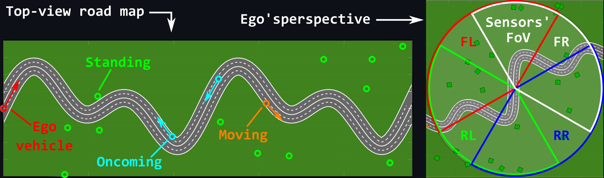
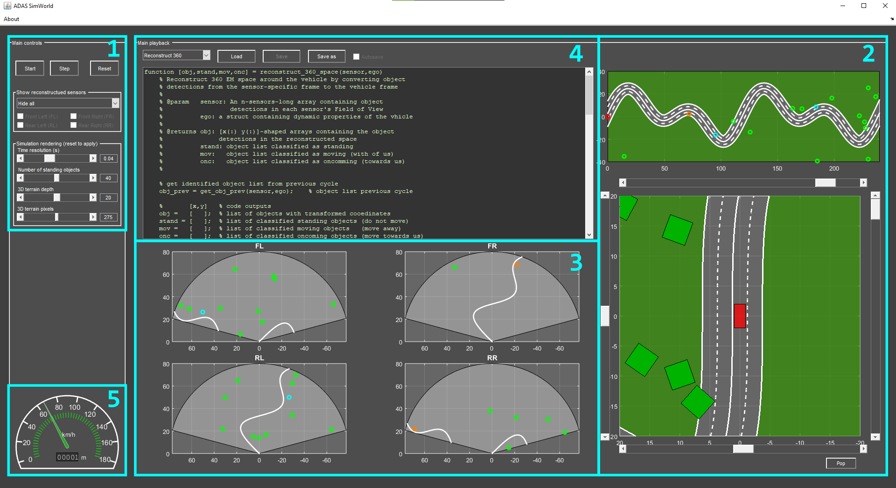
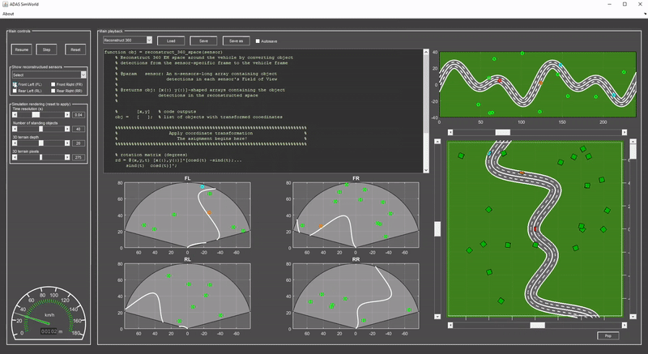
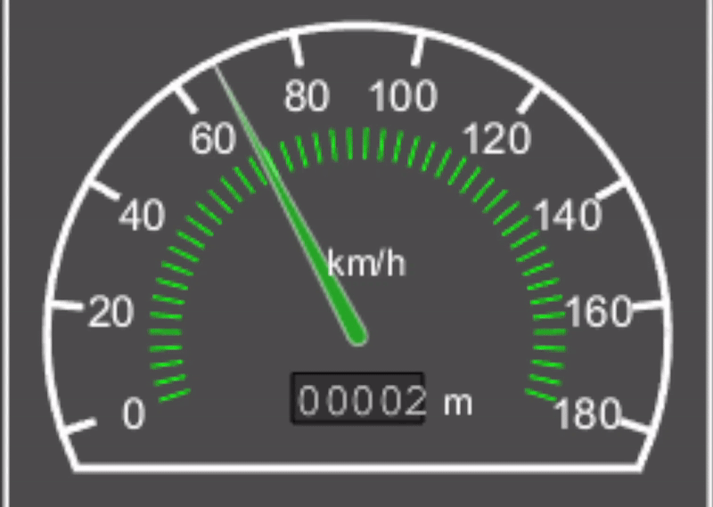
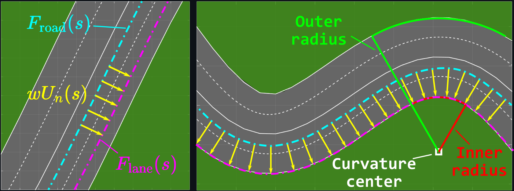
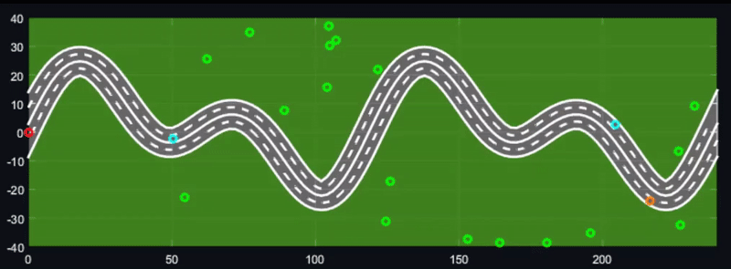
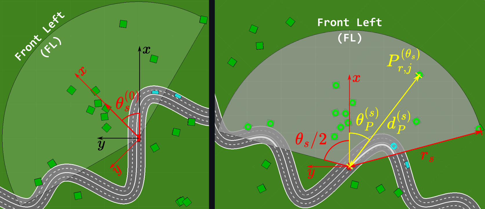
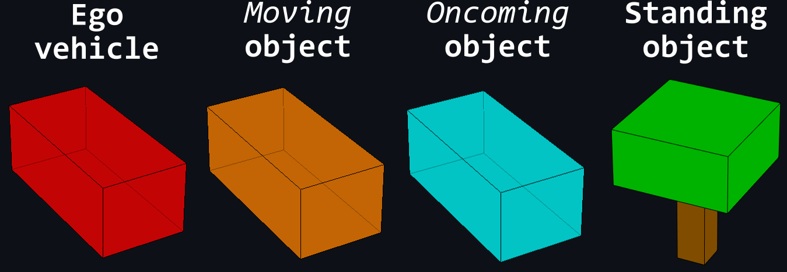

# ADAS SimWorld


SimWorld is a synthetic data egenration tool for the simulation of sensor-based object detection and tracking araound an ego vechicle in an [Advanced Driver Assistance System (ADAS)](https://en.wikipedia.org/wiki/Advanced_driver-assistance_system).
It was designed for mainly for didatic purposes,and the prototyping of simple detection and tracking algortihms.

<p align="center">

</p>

## Table Contents
 - [Introduction](@introduction)
 - [Graphical User Interface](@graphicaluserinterface)
   - [Main control panel](@maincontrolpanel)
   - [Simulation visualizations](@simulationvisualizations)
   - [User code editor](@rsercodeeditor)
   - [Speedometer widget](@speedometerwidget)
 - [Data generation model](@datagenerationmodel)
   - [Road model](@roadmodel)
   - [Time progression](@timeprogression)
   - [Coordinate rotations](@coordinaterotations)
   - [3rd person perspective](@3rdpersonperspective)
   - [3D Terrain model](@3dterrainmodel)
   - [Sensor detections](@sensordetections)
 - [User solutions](@usersolutions)
 - [A peek under the hood](@apeekunderthehood)
   - [Software architecture](@softwarearchitecture)
    - [SimWorld inhabitants](@simworldinhabitants)
    - [Ego Vehicle](@egovehicle)
    - [Moving objects](@movingobjects)
    - [Standing Objects](@standingobjects)
 - [Widgets](@widgets)

## Introduction

ADAS SimWorld is a simple MATLAB toolbox for the quick visualization of synthethically-generated sensor detections and the prototyping of simple objetc tracking and classification algorithms.
It simulates the motion of an ego vehicle along a (periodic) road,using four arbitrary sensors to analyze its surroundings.

All data is generated "on the fly", using a set of base equations.
As the ego vehicle progresses through the road, it comes accross both stationart and moving objects, which get detected by the surrounding sensors.

This tool provides a simple Graphical User Interface (GUI), which offsers a visualization of the real-time simulated world, the object detections in each of the surrounding four sensors' field of view, and a text editor to implement the tracking algorithm code.
A detailed description of the GUI can be found in the [Graphical User Interface](@graphicaluserinterface) section.

<p align="center">

</p>

## Graphical User Interface

The GUI is divided into 5 components, as illustrated in the figure below:
 1. [Main control panel](@maincontrolpanel)
 2. [Simulation visualizations](@simulationvisualizations)
 3. Sensors' Field of View (FoV)
 4. [User code editor](@rsercodeeditor)
 5. [Speedometer widget](@speedometerwidget)

<p align="center">

</p>

### Main control panel

The main control panel allows reseting, playing and stepping the simulation, as well as setting some basic configurations.
These include toggling over the active sensors, and setting a few render parameters (such as speed and resolution).

The sensor acivation/deactivation is illustrated in the video below.

<p align="center">

</p>

### Simulation visualizations

These allow setting the 3D perpective view over the simulation space.
The video below illustrates how the four sliders surrounding the 3rd person simulation visualizaition panel can be used to control the zoom (top slider), tilt (right slider), pan (left slider) and rotation (bottom slider).

<p align="center">

</p>

### User code editor

The GUI offers a simple text editor for the user to implement and quickly test their code.
As of version `1.0`, the user code API includes only the function `reconstruct_360_space`, which is meant to reconstruct the sensor readings from their sensor-specific coordinate systems to the global ego reference.
Two solutions are provided for this code, with and without object classification algorithmalgorithms.
The GUI is prepared to host more than one code file to implement different functionalities. The code editor allows choosing the file by a drop down menu at the top-left of the _Main playback_ panel.

More information on the implementations can be found in [User solutions](@usersolutions) section.

<p align="center">

</p>

### Speedometer widget

Widget modules can be added to the code as extended visualization tool.
A simple speedometer widget is included as part of the base software as an example of an external add-on.
In this case, this speedometer displayes the instant ego speed in km/h, as well as the cumulative travelled distance.

<p align="center">

</p>

## Data generation model

All SimWorld data is synthetically generated in real-time as the simulation runs.
This section highlights the main principles and equations for the data generation.

### Road model

The ego's progression along the SimWorld road is obtained from a very simple set of principles and equations.

#### Base principles:
 - The road shape is defined by via a periodic parametrical equation.
 - Every object on the road and the elements that build the road itself (e.g. lanes) are governed by the road equation.
 - Each moving object (including the ego vehicle) moved along the road by a fix time dpendence equation.
 - The road's parameterization vector is the only pre-established data array. The position and dynamic properties of every moving objects is then deterministically calculated for each moment in time, from the setp of equations that define their time-dependent p+roperties.
 - The 3rd-person view of SimWorld in the perspective of the ego vehicle is obtained by roatiting every environment element around the ego, by and angle $\theta$ defined by orientation of the road at the ego vehicle's position.

#### Base equations:

The road equation is the main SimWorld defining function.
In its most general form, the road shape $F_{\mathrm{road}}$ can be defined as:

$$
F_{\mathrm{road}}(s) =
\begin{bmatrix}
f_\mathrm{road}^{(x)}(s)\\
f_\mathrm{road}^{(y)}(s)\\
f_\mathrm{road}^{(z)}(s)
\end{bmatrix}
$$

where $s$ is a geometrical parameterization, and $f_\mathrm{road}^{(j)}(s),\ j = \{x,y,z\}$ are the road's cartesian component functions.
Programmatically, $s$ is defined by an array, while $F_{\mathrm{road}}$ is defined by a set of equations.

For simplicity, this base implementation defines $f_\mathrm{road}^{(z)}(s)$,  $f_\mathrm{road}^{(x)}(s) = s$, and $f_\mathrm{road}^{(y)}(s)$ as a function of its $f_\mathrm{road}^{(x)}(s)$, i.e., 

$$
F_{\mathrm{road}}(s) =
\begin{bmatrix}
s\\
f_\mathrm{road}^{(y)}(s)\\
0
\end{bmatrix}
$$

or in other words, $f_\mathrm{road}^{(x)}(s) = x$ and $f_\mathrm{road}^{(y)}(s)=f_\mathrm{road}^{(y)}(x)$.

As mentioned in ther [Base principles](@baseprinciples), $f_\mathrm{road}^{(y)}(x)$ must be periodic.
Moreover, the range of the paramterization array $s$ must be an integer multiple of the periodicity of $F_{\mathrm{road}}$.
This base implementation uses the following function, which complies with these requirements:

$$
f_\mathrm{road}^{(y)}(x) = \frac{T}{3}\sin \left(\frac{2\pi}{T}x\right) \cos \left(\frac{2\pi}{T/3}x\right)
$$

where $T$ is the road period, and thus $s\in\left[nT ,mT \right],\ n < m\ \mathrm{and}\ n,m\in\mathbb{Z}$.

Hence, for simplicity, let us from now on assume that the road is defined along the $XY$ plane (its $z$ component is null).
It is important to notice that $f_\mathrm{road}^{(y)}(x)$ only defines the _center_ of the road.
Since moving objects do not all move along the center, each road lane must be defined along a perpendicular expansion of $f_\mathrm{road}^{(y)}(x)$.
This can be achieved by calculating the vector $U(s)$ that is perpendicular to $F_{\mathrm{road}}(s)$ along the $s$ parameterization,

$$
U(s) = 
\begin{bmatrix}
u_x(s)\\
u_y(s)\\
u_z(s)
\end{bmatrix} =
\frac{\mathrm{d}}{\mathrm{d}s} 
\begin{bmatrix}
-f_\mathrm{road}^{(y)}(s)\\
f_\mathrm{road}^{(x)}(s)\\
0
\end{bmatrix}
$$

which, in its normalized form $U_n$,

$$
U_n(s) =
\frac{U_n(s)}{\lVert U_n(s) \rVert} = 
\frac{U(s)}{\sqrt{u_x^2(s) + u_y^2(s) + u_z^2(s)}}
$$

can be used to express the function $F_\mathrm{lane}$ for a lane displace from the road center by the distance $w,\ w \in \mathbb{R}$ as:

$$
F_\mathrm{lane}(s) =
\begin{bmatrix}
f_\mathrm{lane}^{(x)}(s)\\
f_\mathrm{lane}^{(y)}(s)\\
0
\end{bmatrix} =
F_\mathrm{road}(s) + wU_n(s)
$$

so that, effectively,

$$
F_\mathrm{lane}(s) = 
\begin{bmatrix}
f_\mathrm{road}^{(x)} - w \frac{\mathrm{d}}{\mathrm{d}s} f_\mathrm{road}^{(y)} \Bigg/ \sqrt{ \left(\frac{\mathrm{d}}{\mathrm{d}s} f_\mathrm{road}^{(x)}\right)^2 + \left(\frac{\mathrm{d}}{\mathrm{d}s} f_\mathrm{road}^{(y)}\right)^2 }\\
f_\mathrm{road}^{(y)} + w \frac{\mathrm{d}}{\mathrm{d}s} f_\mathrm{road}^{(x)} \Bigg/ \sqrt{ \left(\frac{\mathrm{d}}{\mathrm{d}s} f_\mathrm{road}^{(x)}\right)^2 + \left(\frac{\mathrm{d}}{\mathrm{d}s} f_\mathrm{road}^{(y)}\right)^2 }\\
0
\end{bmatrix}
$$

where the $s$ dependencies on the right side of the equals sign are omitted for sintax simplicity.
The figure below illustrates the lane widening obtained using the equations above.

<p align="center">

</p>

As shown ahead in the [Time progression](@timeprogression) section, $F_\mathrm{lane}(s)$ is used not only to draw the road edges, but also to define the trajectory of each moving object.

### Time progression

ADAS SimWorld uses a very simple time progression scheme, where the position of moving objects is governed by a universal equation

$$
s(t) = v_st
$$

where $v_s$ is a constant speed along the parameterization $s$ and $t$ is the time, obtained at iteration $k$ by

$$
t_k = t_{k-1} + \delta t
$$

where $\delta t$ is the simulation's temporal resolution.
Using this, the position of a given moving object (including the ego vehicle), given by

$$
P_\mathrm{mov}(s,t) = 
\begin{bmatrix}
p_\mathrm{mov}^{(x)}(s,t)\\
p_\mathrm{mov}^{(y)}(s,t)\\
p_\mathrm{mov}^{(z)}(s,t)
\end{bmatrix}
$$

becomes

$$
P_\mathrm{mov}(s,t) = F_\mathrm{lane}(s(t)) =
\begin{bmatrix}
f_\mathrm{lane}^{(x)}(s(t))\\
f_\mathrm{lane}^{(y)}(s(t))\\
f_\mathrm{lane}^{(z)}(s(t))
\end{bmatrix} = 
\begin{bmatrix}
f_\mathrm{lane}^{(x)}\bigg|\_{f_\mathrm{road}^{(x)}(s(t))}\\
f_\mathrm{lane}^{(y)}\bigg|\_{f_\mathrm{road}^{(y)}(s(t))}\\
f_\mathrm{lane}^{(z)}\bigg|\_{f_\mathrm{road}^{(z)}(s(t))}\\
\end{bmatrix}
$$

where the $A\big|\_f$ notation represents the application of operator $A$ to the function $f$. 

Using the above-mentioned simplified case where $f_\mathrm{road}^{(z)}(s) = 0$, $f_\mathrm{road}^{(x)}(s) = s \equiv x$ , and $f_\mathrm{road}^{(y)}(s)$ as a function of its $f_\mathrm{road}^{(x)}(s)$, then $P_\mathrm{mov}(s,t)$ becomes simply

$$
P_\mathrm{mov}(x,t) = 
\begin{bmatrix}
f_\mathrm{lane}^{(x)}\bigg|\_{x(t)}\\
f_\mathrm{lane}^{(y)}\bigg|\_{f_\mathrm{road}^{(y)}(x(t))}\\
0
\end{bmatrix} = 
\begin{bmatrix}
x(t) - w \frac{\mathrm{d}}{\mathrm{d}s} f_\mathrm{road}^{(y)}(x(t)) \Bigg/ \sqrt{ \left(\frac{\mathrm{d}}{\mathrm{d}s} x(t)\right)^2 + \left(\frac{\mathrm{d}}{\mathrm{d}s} f_\mathrm{road}^{(y)}(x(t))\right)^2 }\\
f_\mathrm{road}^{(y)}(x(t)) + w \frac{\mathrm{d}}{\mathrm{d}s} f_\mathrm{road}^{(x)}(x(t)) \Bigg/ \sqrt{ \left(\frac{\mathrm{d}}{\mathrm{d}s} x(t)\right)^2 + \left(\frac{\mathrm{d}}{\mathrm{d}s} f_\mathrm{road}^{(y)}(x(t))\right)^2 }\\
0
\end{bmatrix}
$$

In the present implementation, moving objects are destinguished by their moving direction.
Objects moving in the same direction as the ego vehicle are labelled as _moving_ objects, while objects moving towards the ego are labelled as _oncoming_ objects.
The only distintive feature between _moving_ and _oncoming_ objects is that the former are modeled using a negative $v_s$ value, while the later use apositive $v_s$.
The dynamic properties of the ego vehicle are equivalent to those of _moving_ objects.

The video below illustrates the result of this time progression scheme for all object types, using green, orange, and cyan circles to illustrate _standing_, _moving_, and _oncoming_ objects, respectively.
The ego vehicle is represented by a red circle.

<p align="center">

</p>

As the video shows, objects move continuously along the priod road (an object moving out of one end of the map comes back from the opposite one).
More information about this periodicity implementation is provided in the [A peek under the hood](@apeekunderthehood) section.

Each moving object's rotation about their own rotation center is then obtained from the orientation $\theta_l$ of the object's lane at their current position $P_\mathrm{mov}(x,t)$, relative to the $X$ axis

$$
\theta_l(t) = \arctan\left(
\frac{\mathrm{d}}{\mathrm{d}t} f_\mathrm{lane}^{(y)}(s(t))
\bigg/
\frac{\mathrm{d}}{\mathrm{d}t} f_\mathrm{lane}^{(x)}(s(t))
\right)
$$

**_NOTE:_** All usages of the $\arctan$ function should be regarded as its `atand2` range-modified implementation.

Details about how object rotations are obtained can be found in the [Coordinate rotations](@coordinaterotations) section.

### Coordinate rotations

All coordinate transformations are performed using [rotation matrices](https://en.wikipedia.org/wiki/Rotation_matrix).

$$
R_{X}(\theta) = 
\begin{bmatrix}
1 & 0            & 0            \\
0 & \cos(\theta) & -\sin(\theta)\\
0 & \sin(\theta) & \cos(\theta)
\end{bmatrix},\ \  
R_{Y}(\theta) = 
\begin{bmatrix}
\cos(\theta) & 0 & \sin(\theta)\\
0            & 1 & 0           \\
-\sin(\theta) & 0 & \cos(\theta)
\end{bmatrix},\ \  
R_{Z}(\theta) = 
\begin{bmatrix}
\cos(\theta) & -\sin(\theta) & 0\\
\sin(\theta) & \cos(\theta)  & 0\\
0            &               & 1
\end{bmatrix}
$$

where $R_X$, $R_Y$, and $R_Z$ are the rotation matrices that rotate a cartezian matrix $A$ around the $X$, $Y$, and $Z$ axes, respectively by

$$
A_r^{(\theta)} = R_j(\theta)A
$$

where $A_r^{(\theta)}$ is the rotation of matrix $A$ by and angle $\theta$ about the $j$ axis, with $j = \{X,Y,Z\}$.

Since we have pre-established that in the present SimWorld implementation the road is limited to the $XY$ plane, all the necessary rotations are performed about the $Z$ axis.
Thus, instead of performing a lot of unnecessary calculations (multiplying and suming a lot of ones and zeros), it is computationally more efficient to simply reduce the rotation to a 2D problem 

$$
R(\theta) = 
\begin{bmatrix}
\cos(\theta) & -\sin(\theta)\\
\sin(\theta) & \cos(\theta)
\end{bmatrix}
$$

and allow all rotated objects to retain their $z$ components, i.e. for a matrix $P = [p_x\ \ p_y\ \ p_z]^\intercal$, its rotated matrix $P_r^{(\theta)}$ is given by

$$
P_r^{(\theta)} =
\begin{bmatrix}
R(\theta)P_{x:y} \\
p_z
\end{bmatrix}
\equiv \mathcal{R}(\theta,P)
$$

For syntax simplicity, let $\mathcal{R}(\theta,P)$ be the function that calculates $P_r^{(\theta)}$ from $P$ in the above manner.

Objects' coordinates can be rotated using $\mathcal{R}(\theta,P)$ around the objects's own center of rotation (e.g.as the object moves along the road), and/or about the ego vehicle (for 3rd person perspective).
The former does not change the objects position, but merely rotates the coordinates of the vertices that make up its cube around the $Z$ axis.
The latter is addressed in more detail in the [3rd person perspective](@3rdpersonperspective) section.
The application of $\mathcal{R}(\theta,P)$ is illustrated the video below.

<p align="center">

</p>

### 3rd person perspective

The 3rd persion perspective around the ego vehicke (bottom-right axes of the GUI) is obtained by rotating each object in the simulation space (including the road) around the ego vehicle.
Hence, the ego vehicle itself is represented (in red) as a stationary object at position $(0,0)$, while every other object is rotated about the $Z$ axis by the angle $\theta_\mathrm{ego}(t)$, the orientation of the ego vehicle at time $t$, relative to the $X$ axis.
$\theta_\mathrm{ego}(t)$ can be calculated analogously to $\theta_l(t)$.
Considering that the ego vehicle moves directly along the road function ($w_\mathrm{ego} = 0$), then we can express it as

$$
\theta_\mathrm{ego}(t) = -\arctan\left(
\frac{\mathrm{d}}{\mathrm{d}t} f_\mathrm{road}^{(y)}(s(t))
\bigg/
\frac{\mathrm{d}}{\mathrm{d}t} f_\mathrm{road}^{(x)}(s(t))
\right) = -
\arctan\left(
\frac{\mathrm{d}}{\mathrm{d}t} f_\mathrm{road}^{(y)}(x(t))
\bigg/
\frac{\mathrm{d}}{\mathrm{d}t} x(t)
\right)
$$

where the minus sign is used by convention to simplify the notation of objects around the ego vehicle.

Hence, the total object rotation can be expressed as 

$$
C_{r,\mathrm{stand}}^{(\theta_\mathrm{ego})}(t) = \mathcal{R}(\theta_\mathrm{ego}(t),C_\mathrm{stand})
$$

for standing objects, and 

$$
C_{r,\mathrm{mov}}^{(\theta_\mathrm{ego}+\theta_l)}(t) = \mathcal{R}(\theta_\mathrm{ego}(t) + \theta_l(t),C_\mathrm{mov})
$$

for the moving objects, where $C_\mathrm{stand}$ and $C_\mathrm{stand}$ represent the list of vertices that make up the shape of standing and moving objects, respectively.

As to the objects' position, all objects (stationary and moving alike) have their position vectors $P$ rotated around the $Z$ axis by the angle $\theta_\mathrm{ego}(t)$, i.e.,

$$
P_{r,j}^{(\theta_\mathrm{ego})}(t) = \mathcal{R}(\theta_\mathrm{ego}(t),P_j(t))
$$

where $j = \{\mathrm{stand},\ \mathrm{mov}\}$.

The figure below illustrates both the orientation and position rotation around the ego vehicle performed to obtain the 3rd person's perspective view.

<p align="center">

</p>

### 3D Terrain model

SimWorld's terrain is modelled by defining its elevation ($z$ component) using a 2D [Gaussian function](https://en.wikipedia.org/wiki/Gaussian_function), which is typically expressed as

$$
G_\mathrm{2D} = a\exp\left(-\left(\frac{
\sqrt{ (\mathcal{X} - b_1)^2 + (\mathcal{Y} -b_2)^2 } }
{c} \right)^2\right)
$$

where $\mathcal{X}$ and $\mathcal{Y}$ are the meshgrids that defined the $XY$ plane, $a$ and $c$ are the peak height and width of the Gaussian distribution, and $(b_1,b_2)$ are the $(x,y)$ coordinates of the Gaussian peak center.
This leads to a single-peaked distribution as depicted below.

In SimWorld, however, instead of a single-peak distribution, a modification of the 2D Gaussian is used to represent the 3D terrain along the road by modulating an _extended_ Gaussian peak along $\mathcal{Y} = f_\mathrm{road}^{(y)}(\mathcal{X})$, i.e.,

$$
G_\mathrm{road} = a\exp\left(-\left(\frac{
\sqrt{ \left(\mathcal{Y} - f_\mathrm{road}^{(y)}(\mathcal{X})\right)^2 }}
{c} \right)^2\right) =
a\exp\left(-\left(\frac{\mathcal{Y} - f_\mathrm{road}^{(y)}(\mathcal{X}) }{c} \right)^2\right)
$$

The figure below illustrates the difference between the typical single-peaked 2D Gaussian function, and the SimWorld road-Gaussian

<p align="center">

</p>

Yet, since the road is by convention of the current implementation restricted to the $XY$ plane ($f_\mathrm{road}^{(z)}(s) = 0$), the terrain topography is effectively obtained by

$$
T_\mathrm{road} = a\left(\exp\left(-\left(\frac{\mathcal{Y} - f_\mathrm{road}^{(y)}(\mathcal{X}) }{c} \right)^2\right) - 1\right)
$$

where $a$ and $c$ are optimized to fit the road width, and the road area itself is cropped out of $T_\mathrm{road}$.

### Sensor detections

The sensor readings are obtained in two simple steps:
First, rotating the position of all SimWorld objects around the ego vehicle by the sensor mounting angle $\theta_s^{(0)}$

$$
P_{r,j}^{(\theta_s)}(t) = 
\begin{bmatrix}
p_{r,j}^{(\theta_s,x)}(t) \\
p_{r,j}^{(\theta_s,y)}(t) \\
p_{r,j}^{(\theta_s,z)}(t)
\end{bmatrix} =
\mathcal{R}\left(\theta_s,P_{r,j}^{(\theta_\mathrm{ego})}(t)\right) 
$$

where $j = \{\mathrm{stand},\ \mathrm{mov}\}$.
Then, determining which objects lie within the sensor field field of view, i.e., the objects whose distance $d_P^{(s)}(t)$ from the sensor

$$
d_P^{(s)}(t) = \left\lVert P_{r,j}^{(\theta_s)}(t) \right\rVert
$$

is shorter than the sensor range $r_s$, and azimith $\theta_P^{(s)}(t)$ and polar \phi_P^{(s)}(t) angular coordinates relative to the sensor frame

$$
\theta_P^{(s)}(t) = \arctan\left( 
p_{r,j}^{(\theta_s,y)}(t) \bigg/ p_{r,j}^{(\theta_s,x)}(t)
\right)
$$
$$
\phi_P^{(s)}(t) = \arccos\left(\frac{
p_{r,j}^{(\theta_s,z)}(t)}
{d_P^{(s)}(t)}
\right)
$$

lie within the sensor angular ranges $[-\theta_s/2, \theta_s/2]$, $[-\phi_s/2, \phi_s/2]$, respectively.

In this base implementation however, for simplicity, the vertical components of the objects' positions is ignored.
Hence, 

$$
d_P^{(s)}(t) \approx \left\lVert P_{r,j|x:y}^{(\theta_s)}(t) \right\rVert
$$

and only the azimuth range is considered, as illustrated in the figure blow.

<p align="center">

</p>


## User solutions

The main goal of ADAS SimWorld is to offer a simulation platform for detection processing algorithm prototyping.
This implementation is mainly focused in the synthetic generation of data that can be used to test new algorithms, or for didatic purposes, so that new-lerners can get acquianted with tracking algorithms.

Hence, this base implementation offers two simple codes for processing the sensor-wise object detections and transform them from the sensor-specific coordinate systens to the combined 360$^o$ environment around the ego vehicle, which are described below:
 1. Performing only the necessary coordinate transformations
 2. Performing a two-cycle object tracking to classify objects into _staning_, _moving_, or _oncoming_ objects, based on their kinematic properties.

As an input, the user receives up to two imput argumets, `sensor` and `ego`, which contain the following dataset:

`sensor`:
 - `sensor.n`: number of sensors
 - `sensor.fov`: (m,deg) field of view distance and angular ranges
 - `sensor.theta`: (deg) sensor mounting angles
 - `sensor.pos`: sensor position (`FL`,`RL`,`RR`,`FR`)
 - `sensor.active`: boolean if sensor is active
 - `sensor.data`: (m) object xy data measured by each sensor
 
where `sensor.data` is restricted to the $XY$ plane.
Since the user is agnostic to the transformations performed internally to obtain the sensor-specific data, let $P_{x:y}^{(s)}$ represent the sensor measurements received as input by the user at the simulation timestamp $t$

$$
P_s = P_{r,j|x:y}^{(\theta_s)}(t)
$$
 
`ego` (optional):
 - `ego.Dtheta`: (deg) ego vehicle moving direction angle
 - `ego.v_xy`: (m/s) ego vehicle velocity
 - `ego.v`: ego speed
 - `ego.dt`: simulation cycle duration

### Solution 1: No tracking

The first ans simpler solution can be summarized as the trivial coordinate transformation from the sensor-specific reference system to the unified ego vehicle's.
This can be done by iterating over each sensor and using $\mathcal{R}(\theta_s^{(0)},P_s)$ to perform the rotation around the ego vehicle.

The key part of the first user solution is presented below.

```
% rotation matrix (degrees)
    rd = @(x,y,t) [x(:),y(:)]*[cosd(t) -sind(t);...
                               sind(t) cosd(t)]';
for ii = 1 : sensor.n                           % iterate over sensor array
    if sensor.active(ii)                        % sensor is active by the user
        theta = sensor.theta(ii);               % sensr mounting angle
        obj_x = sensor.data{ii}(:,1);           % object position x
        obj_y = sensor.data{ii}(:,2);           % object position y
        obj = cat(1,obj,rd(obj_x,obj_y,theta)); % object rotated
    end
end
```

### Solution 2: 2-cycle object tracking and classification

The second user-solution provided by this base implementation of ADAS SimWorld builds on the first solution by using the provided `get_obj_prev()` function to obtain the object positions in the previous cycle.
This allows calculating the object displacement since the previous cycle and the object absolute velocity, which allows a basic classification into _standing_, _moving_, or oncoming_ objects types.

Calculating the kinematic properties of the tracked objects is the challenging part of this solution, since we must validate the current cycle detections against those of the previous cycle, and determin which detections coccrespond to which.
This gets further complicated by the fact that some objects will have left the sensor field of view from one cycle to the next, while other will have entered it.

This filtering step is done by calculating the displacement between each pair of current and previous detections and finding the closest previous-to-current object detection.
If the calculated displacement tends to zero, we can be confident that this corresponds to a standing objects.
Otherwise, we must declare a maximum admissible inter-cycle displacement and discard detections whose displacement are above that threshold.
The remaining detections can then be classified into _moving_ or _oncoming_ depending on the $x$ component of their velocity:

 - Objects with a considerably negative and positive $x$ velocity are classified as _oncoming_ and _moving_ respectively.
 - Objects with an $x$ velocity close to zero get no classification, meaning that they are probably crossing objects moving sideways relative to the ego vehicle.

The key part of the second user solution is presented below.

```
% get identified object list from previous cycle
obj_prev = get_obj_prev(sensor,ego);    % object list previous cycle

if ~isempty(obj)
    % compensate ego rotation in previous cycle
    obj_prev = rd(obj_prev(:,1),obj_prev(:,2),ego.Dtheta);

    % calculate displacement matrix
    d_x = bsxfun(@minus,obj(:,1), obj_prev(:,1)');  % displacement x
    d_y = bsxfun(@minus,obj(:,2), obj_prev(:,2)');  % displacement x
    d_mat = sqrt(d_x.^2 + d_y.^2);                  % displacement abs

    % find the closest object from the previous cycle
    [dmin,imin] = min(abs(d_mat),[],2);                 % min d and ind
    ind = sub2ind(size(d_x), (1:length(imin))', imin);  % matrix ind

    % calculate object x y velocity
    obj_v = bsxfun(@plus,[d_x(ind),d_y(ind)]/ego.dt,ego.v_xy);% vel xy

    % identify tracked objects
    obj_tracked = obj(dmin <= thresh_d_max,:);  % tracked objects list
    obj_v(dmin > thresh_d_max,:) = [];          % tracked objects speed

    % calculate absolute velocity
    obj_speed = sqrt(obj_v(:,1).^2 + obj_v(:,2).^2); % obect speed
    obj_v_sign = obj_speed .* sign(obj_v(:,1)); % x-dir signed speed

    %%%%%%%%%%%%%%%%%%%%%%%%%%%%%%%%%%%%%%%%%%%%%%%%%%%%%%%%%%%%%%%%%%%
    %                     Object classification                       %
    %%%%%%%%%%%%%%%%%%%%%%%%%%%%%%%%%%%%%%%%%%%%%%%%%%%%%%%%%%%%%%%%%%%

    % standing objetcs
    stand = obj_tracked(obj_speed < thresh_v_stand_max,:);

    % moving objects
    mov = obj_tracked(obj_v_sign > thresh_v_mov_min,:);

    % oncoming objects
    onc = obj_tracked(obj_v_sign < -thresh_v_mov_min,:);

    % output updated object list to base workspace
    assignin('base','obj_prev',obj);
end
```

**_NOTE:_**  The function `bsxfun()` is used for backwards compatibility with legacy MATLAB versions that do not allow inconsistent sized matrix operations.

## A peek under the hood

### Software architecture

### SimWorld inhabitants

The three types of SimWorld objects can be distinguished by their shape and color, as shown in the figure below.

<p align="center">

</p>

Apart from the _moving_ and _oncoming_ objects, which are both of the type moving object, each object type has unique properties, as listed below:

### Ego Vehicle
Kinematic properties:
 - `v`: (m/s) ego speed
 - `x(t,x_1)`: (m) ego $x$ position function
 - `y(x)`: (m) ego $y$ position function
 - `x_1`: (m) ego $x$ position in previous cycle
 - `theta`:(rad) ego orientation
 
 Note: `ego.theta` is the only angle defined in radians.
 This is done by convention to clearly destinguish between the object rotation (translation about ego vehicle) and orientation (object's orientation) angles when implementing the 3rd person visualization.

Visualization properties:
 - `cube`: cube object for graphical representation
 - `cube.dimensions`: (m) cube dimensions
 - `center`: (m) cube center position
 - `cube.theta`: (deg) cube orientation
 
Sensor properties:
 - `sensor`: sensor object
 - `sensor.n`: number of sensors
 - `sensor.fov.range`: (m) sensor range
 - `sensor.fov.theta`: (deg) sensor angular range
 - `sensor.theta`: (deg) sensor orientation
 - `sensor.fov.draw`: sensor drawing object
 - `sensor.fov.draw.s`: sensor drawing parameter
 - `sensor.fov.draw.fov`: sensors field of view edge
 - `sensor.fov.draw.circ`: sensor-specific FoV edges
 - `sensor.key`: sensor mounting position

### Moving objects

Kinematic properties:
 - `n`: number of moving objects
 - `v`: (m/s) moving object speed
 - `t0`: (s) random starting position (modelled by a time $t_0$ along $x(t)$)
 - `off`: (m) y offset relative to ego (lane position)
 - `lane`: lane object
 - `x_t(t,x_1)`: (m) moving object x position function
 - `x(t,dt,x_1)`: (m) in-lane moving object x position
 - `y(t,dt,x_1)`; (m) in-lane moving object y position
 - `x_1`: (m) moving object x position in previous cycle
 
 Visualization properties:
 - `cube`: list of cube objects
 - `cube(:).dimensions`: (m) mocing object dimensions
 - `cube(:).theta`: (deg) cube orientation
 - `cube(:).x`: (m) cube center x position
 - `cube(:).y`: (m) cube center y position
 - `cube(:).z`: (m) cube center z position
 - `cube(:).idx`: cube vertex drawing indices

### Standing objects

Kinematic properties:
 - `n`: standing (static) objects properties
 - `x`: (m) standing object x position
 - `y`: (m) standing object y position
 - `z`: (m) standing object z position
 
Visualization properties
 - `faces`: indices of tree-shaped patch faces
 - `color`: standing object color map
 - `shape`: list of shape objects
 - `shape(:).dimensions`: randomized tree-shape dimensions
 - `shape(:).theta0`: shape initial orientation
 - `shape(:).theta`: ego orientation (required for 3rd person perspective rotation)
 - `shape(:).faces`: object-specific patch faces
 - `shape(:).vertices`: shape vertixes

## Widgets

